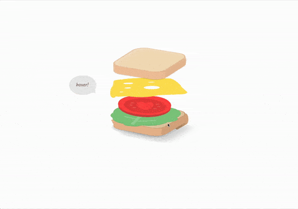

## Readme

# 🥪 Animated Sandwich

This project features an animated sandwich with various layers of ingredients, showcasing intricate CSS animations and hover effects.

## 📦 Technologies

Built with:

- `HTML:` Markup language for creating the structure.
- `CSS:` For styling and animations.

## ⚙️ Getting Started

To view and interact with the animated sandwich:

1. Download the project files.
2. Open the `index.html` file in Visual Studio Code.
3. Use the Live Server extension in VS Code to view the project in your web browser.

## 🖱️ Interaction

Hover over the sandwich to see the layers animate and expand, creating a delightful visual effect.

## 🛣️ Project Structure

Here are the key files and their purposes:

- **index.html**: The main HTML file containing the structure of the animated sandwich.
- **style.css**: The CSS file that styles the sandwich and adds animations.

Feel free to explore and customize these files to suit your needs!

## 🔄 Animations

The sandwich animation includes various CSS animations that create a dynamic and engaging effect. Here’s an overview:

- **Bread Layers**: The bread layers move and create a stacking effect on hover.
- **Lettuce**: The lettuce leaves rotate and shift slightly on hover.
- **Tomato**: The tomato slices rotate and move to add depth.
- **Cheese**: The cheese slices adjust their position to create a melting effect.
